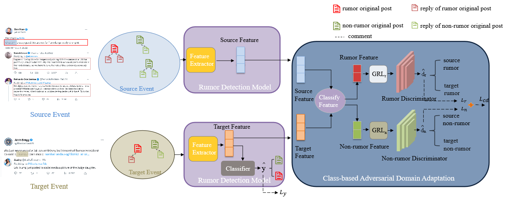

# CADA
Reproduced code of ACM-MM 2023 &lt;Improving Rumor Detection by Class-based Adversarial Domain Adaptation>

## Model Architecture 
In the paper [Improving Rumor Detection by Class-based Adversarial Domain Adaptation](https://dl.acm.org/doi/abs/10.1145/3581783.3612501), there are two components:
The rumour detection model and the class-based adversarial domain adaptation module. 

In our codes, they are implemented by three modules: the feature extractor, the label classifier and the domain classifier, as shown in CADA.py.





## Dataset

To experiment the model's cross-domain detection ability, we use the Twitter dataset and Twitter-COVID19 dataset as the source domain and target domain datasets. They can be downloaded from [NAACL-2022 ACLR](https://github.com/DanielLin97/ACLR4RUMOR-NAACL2022/tree/main/data). Download the Twitter and Twitter-COVID19 datasets, unzip them into directories ./data/in-domain and ./data/out-of-domain. The finalised directory architecture should be like this:

```plaintext
├── project_root/
│   ├── data/
│   │   ├── in-domain/
|   |   |   |   ├──Twitter/
|   |   |   |   ├──Twittergraph/
│   │   ├── out-of-domain/
|   |   |   |   ├──Twitter/
|   |   |   |   ├──Twittergraph/
│   ├── ...
│   ├── README.md
```

## Implementation setting. 

In the reproduce, we design the CADA as an individual object which takes feature extractor, label classifier and domain classifier as parameters. You can substitude the three components with any modules (eg. BERT, GCN, MLP). The original paper uses GACL and BERT as the framework of these three components. Instead, for the conveniece of implemetation, we use the [BiGCN]
(https://ojs.aaai.org/index.php/AAAI/article/view/5393). 

## To Run

### requirement: 

```
numpy
pytorch
torch_geometric
torch_scatter
sklearn
random
```

A detailed requirements file with version on my device is shown in requirements.txt. 

### Run the code

```
python main.py
```


